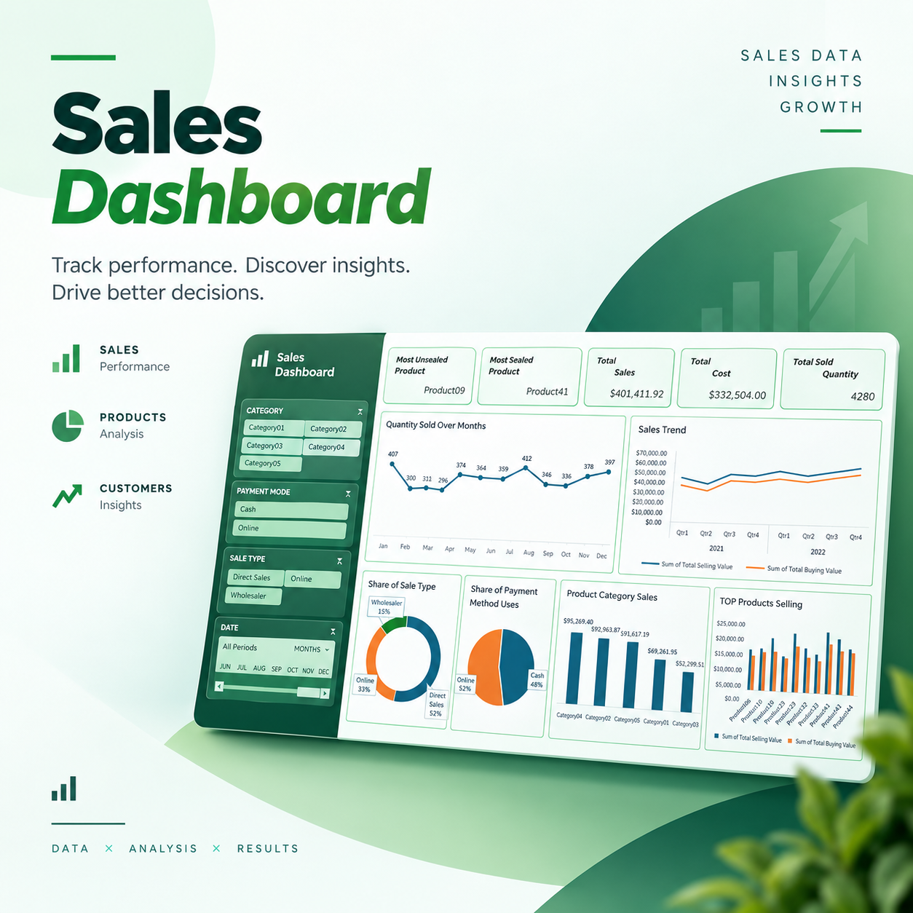
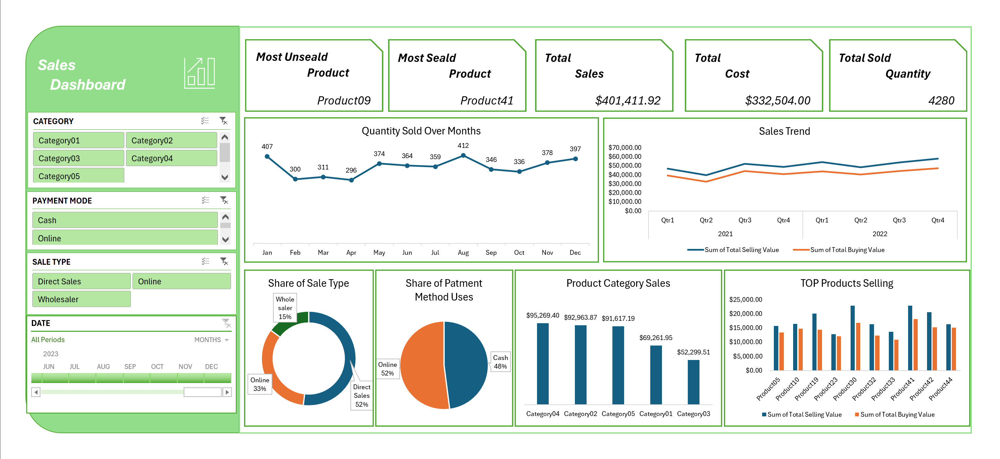

# Sales Performance Analytics Dashboard (Microsoft Excel)


An end-to-end Sales Analytics solution that transforms 10,000+ raw, unorganized transactional records into an interactive, single-page executive decision engine built entirely in **Microsoft Excel**. This project automates ETL workflows using Power Query, establishes a relational data model with Power Pivot and DAX, and delivers dynamic visual insights for business stakeholders.

---

## 🖼️ Dashboard Cover


> *Figure 1.0: Full Interactive Excel Dashboard featuring KPI summary cards, cross-filtering slicers, and dynamic sales visualizations.*

---


---

## 🖼️ Dashboard Preview


> *Figure 1.0: Full Interactive Excel Dashboard featuring KPI summary cards, cross-filtering slicers, and dynamic sales visualizations.*

---

## 📌 Problem Statement

Small to mid-sized businesses frequently store thousands of sales transactions across fragmented, unformatted spreadsheets. This creates several key operational challenges:

* **Manual Reporting Overhead:** Answering standard queries (e.g., top revenue drivers, monthly seasonality) requires hours of repetitive copy-pasting and manual filter updates.
* **Data Quality Issues:** Duplicate transaction IDs, null customer records, and unstandardized date formats lead to inaccurate financial metrics.
* **Lack of Margin Visibility:** Decision-makers lack real-time visibility into net profit margins, preferred payment channels, and inventory demand cycles.

**Goal:** Build an automated, reusable Excel analytical asset that converts raw transactional data into clear, actionable business intelligence with zero ongoing manual cleanup.

---

## 🏗️ Architecture & Data Workflow

```
┌─────────────────────────┐
│ Raw Transactions (CSV) │
└────────────┬────────────┘
             │
             ▼
┌─────────────────────────┐
│     1. Power Query      │ ──► Data Cleaning, Date Standardization,
│      (ETL Pipeline)     │     Null Treatment & Dynamic Custom Columns
└────────────┬────────────┘
             │
             ▼
┌─────────────────────────┐
│   2. Data Model (Pivot) │ ──► Star Schema, Dimensional Relationships,
│     (DAX Calculations)  │     Time Intelligence & Financial Measures
└────────────┬────────────┘
             │
             ▼
┌─────────────────────────┐
│  3. Executive Dashboard │ ──► Interactive Slicers, KPI Cards,
│     (Visual Engine)     │     Trend Charts & Payment Channel Breakdown
└─────────────────────────┘
```

---

## 🛠️ ETL & Data Transformation (Power Query)

The raw dataset was ingested and cleaned using **Power Query Editor** to guarantee a structured, production-ready schema:

1. **Deduplication & Null Treatment:** Filtered duplicate order numbers and resolved missing product/customer fields.
2. **Standardization & Parsing:** Converted text dates to standardized `YYYY-MM-DD` date objects and trimmed whitespace across categorical columns.
3. **Calculated Field Logic:**
   * $\text{Total Revenue} = \text{Quantity} \times \text{Unit Price}$
   * $\text{Total Cost} = \text{Quantity} \times \text{Unit Cost}$
4. **Schema Cleanup:** Normalized regional sales records to maintain strict row-based consistency.

---

## 📐 Data Modeling & DAX Measures (Power Pivot)

The cleansed dataset was loaded directly into Excel's **Data Model** to build a normalized **Star Schema** linking fact tables with dimension tables (`Dim_Product`, `Dim_Calendar`, `Dim_Channel`).

### Key DAX Measures Formulated:

* **Total Revenue:**
  $$\text{Total Sales} := \text{SUM}(\text{Fact\_Sales[Revenue]})$$

* **Total Cost:**
  $$\text{Total Cost} := \text{SUM}(\text{Fact\_Sales[Cost]})$$

* **Gross Profit:**
  $$\text{Gross Profit} := [\text{Total Sales}] - [\text{Total Cost}]$$

* **Profit Margin (%):**
  $$\text{Profit Margin \%} := \text{DIVIDE}([\text{Gross Profit}], [\text{Total Sales}], 0)$$

* **Total Quantity Sold:**
  $$\text{Total Units} := \text{SUM}(\text{Fact\_Sales[Quantity]})$$

* **Month-over-Month (MoM) Growth:**
  $$\text{MoM Sales Growth} := \text{DIVIDE}([\text{Total Sales}] - [\text{Prior Month Sales}], [\text{Prior Month Sales}], 0)$$

---

## 📊 Dashboard Features & Layout

* **Executive KPI Cards:** Real-time visibility into Total Sales, Gross Profit, Unit Volume, and Profit Margins.
* **Interactive Slicers:** Universal cross-filtering by *Region*, *Product Category*, *Sales Type (B2B/B2C)*, and *Timeline (Year/Quarter)*.
* **Product Performance Analysis:** Highlights top 10 revenue-generating SKUs versus low-performing inventory items.
* **Monthly Sales Seasonality:** Visual time-series tracking demand fluctuations and revenue surges.
* **Payment Channel Distribution:** Donut visualization displaying customer payment preferences (Credit Card, PayPal, Direct Transfer, Cash).

---

## 💡 Key Business Insights

1. **80/20 Profit Driver Rule:** Top 20% of product SKUs generate over ~65% of net profit margins, identifying key inventory priorities.
2. **Q4 Demand Surge:** Sales volume peaks significantly between October and December, requiring inventory replenishment 30 days prior.
3. **Digital Payment Preference:** Digital channels account for ~70% of total transactions, accelerating cash flow settlement cycles.

---

## 🚀 How to Run & Replicate

1. **Clone or Download:** Download the repository files or raw `.xlsx` asset locally.
2. **Open File:** Launch `Sales_Performance_Dashboard.xlsx` in Microsoft Excel (2016 or newer recommended for Power Query & Power Pivot support).
3. **Enable Data Connections:** Click **Enable Content** on the security banner to activate data model queries and dynamic slicers.
4. **Update Source Path (Optional):**
   * Go to **Data** tab ➔ **Queries & Connections**.
   * Right-click `Fact_Sales` ➔ **Edit in Power Query Editor**.
   * Update the `Source` step file path to point to your local raw dataset, then click **Close & Apply**.
5. **Interact:** Use the dynamic slicers on the control panel to cross-filter performance metrics dynamically.

---

## 💻 Technical Tools Applied

* **Platform:** Microsoft Excel (2016+)
* **ETL Pipeline:** Power Query Editor
* **Data Modeling:** Power Pivot, Star Schema, DAX (Data Analysis Expressions)
* **Visualization:** Excel Pivot Charts, Dynamic Slicers, Custom Number Formatting, Conditional Formatting

---

### 📩 Contact & Connect
Have questions, suggestions, or feedback about this portfolio project? Let's connect on [LinkedIn](https://www.linkedin.com/ed-mo1) or check out my other data analytics repositories on GitHub!
